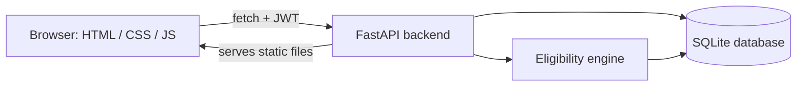

# 🎯 Placement OS
### Student Placement Management System

**A placement tracker that explains eligibility instead of just deciding it.**

[](https://www.python.org/)
[](https://fastapi.tiangolo.com/)
[](https://www.sqlite.org/)
[](#)
[](#license)

[Live Demo Video](#-demo) · [Features](#-features) · [Setup](#-getting-started) · [API Docs](#-api-overview)

</div>

---

## 💡 Why this is different

Most student placement trackers are a form with a green or red "Eligible" tag. That tells a student *what* happened, not *why* — so they have no idea what to fix.

**Placement OS has a small eligibility engine** that checks a student's CGPA, branch, and skills against each company's actual requirements, and returns human-readable reasoning:

> ❌ *CGPA short by 0.3 (need 7.5, have 7.2)*
> ⚠️ *Missing skills: SQL, AWS*
> ✅ *Eligible — apply now*

That reasoning is surfaced directly in the UI as a color-coded **eligibility beacon** (green / amber / red) on every company card — so a student knows exactly what to improve, not just whether they got in.


## ✨ Features

**For students**
- 🔐 Secure registration & login (JWT-based auth, hashed passwords)
- 👤 Editable profile — branch, batch year, contact info
- 🏷️ Skill tracking with proficiency levels (Beginner / Intermediate / Advanced)
- 📈 Semester-wise CGPA entry with an auto-calculated overall CGPA
- 🎯 **Live eligibility engine** — see exactly why you do or don't qualify for each company
- 📨 One-click apply (server re-validates eligibility, so it can't be gamed from the frontend)
- 🧭 Visual application pipeline: Applied → Shortlisted → Interview → Offer / Rejected

**For placement admins**
- 🏢 Add/remove companies with custom eligibility criteria (CGPA, branch, required skills)
- 📊 Analytics dashboard: total students, placement %, branch-wise comparison, package (CTC) distribution — all live charts
- 📋 Searchable student directory across the whole batch

## 🛠 Tech stack

| Layer | Technology |
|---|---|
| Backend | Python, FastAPI, SQLAlchemy |
| Auth | JWT (python-jose), bcrypt password hashing |
| Database | SQLite (dev) — schema is portable to PostgreSQL/MySQL |
| Frontend | HTML5, CSS3, vanilla JavaScript (no build step) |
| Charts | Chart.js |
| API docs | Auto-generated via FastAPI at `/docs` |

## 🏗 Architecture



The frontend never decides eligibility itself — it only renders whatever `/companies/eligibility` returns from the backend. That keeps the business rule in one place and means a student can't fake an "Eligible" state by editing the page.

## 📁 Project structure

```
placement-system/
├── backend/
│   ├── main.py            FastAPI app + all routes
│   ├── models.py          SQLAlchemy tables
│   ├── schemas.py         Pydantic request/response models
│   ├── database.py        DB engine/session setup
│   ├── auth.py             JWT + password hashing
│   ├── eligibility.py      The eligibility engine
│   ├── seed.py             Demo data generator
│   └── requirements.txt
└── frontend/
    ├── index.html          Login / registration
    ├── dashboard.html      Student dashboard
    ├── admin.html          Admin dashboard
    ├── css/style.css       Design system
    └── js/                 api.js, dashboard.js, admin.js
```

## 🚀 Getting started

### 1. Clone the repo
```bash
git clone https://github.com/<your-username>/<your-repo-name>.git
cd <your-repo-name>/backend
```

### 2. Set up the backend
```bash
python -m venv venv
source venv/bin/activate        # Windows: venv\Scripts\activate
pip install -r requirements.txt
python seed.py                  # creates the database with demo data
uvicorn main:app --reload
```

### 3. Open it
Visit **http://localhost:8000** — the frontend is served automatically alongside the API.
Interactive API docs: **http://localhost:8000/docs**

### 🔑 Demo credentials

| Role | Email | Password |
|---|---|---|
| Student | `student1@campus.edu` | `password123` |
| Admin | `admin@campus.edu` | `admin123` |

Or register a brand-new student account from the login page.

## 📡 API overview

Full interactive documentation lives at `/docs`. Highlights:

| Endpoint | Method | Purpose |
|---|---|---|
| `/auth/register` | `POST` | Create a student account |
| `/auth/login` | `POST` | Get a JWT (students and admins) |
| `/students/me` | `GET`/`PUT` | View/update your profile |
| `/students/me/skills` | `POST` | Add or update a skill |
| `/students/me/cgpa` | `POST` | Add or update a semester's CGPA |
| `/companies/eligibility` | `GET` | Eligibility + reasoning for every company |
| `/applications/{company_id}` | `POST` | Apply (re-validated server-side) |
| `/admin/companies` | `POST` | Add a company + its criteria |
| `/admin/analytics` | `GET` | Aggregate stats for the dashboard |

## 🗺 Roadmap

- [ ] Resume upload with heuristic scoring
- [ ] Skill-gap-based course recommendations
- [ ] Email notifications on new eligibility
- [ ] Multi-admin roles with audit log
- [ ] PostgreSQL for production deployment
- [ ] Automated test suite for the eligibility engine

## 🧑‍💻 Running in GitHub Codespaces

1. **Code → Codespaces → Create codespace on main**
2. In the terminal: `cd backend && pip install -r requirements.txt && python seed.py && uvicorn main:app --host 0.0.0.0 --reload`
3. Open the forwarded port 8000 when prompted

## 📄 License

Built as an academic project. Free to use and adapt for coursework or learning.

---


Built by **[SUNAINA B BALLARY]** — [LinkedIn](https://www.linkedin.com/in/sunaina-ballary/)
If this project was useful or interesting, a ⭐ on the repo is appreciated!

