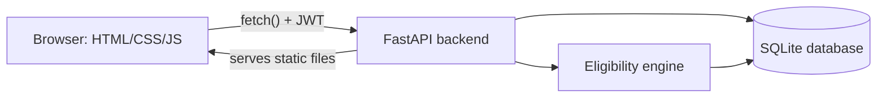

# Placement OS — Student Placement Management System

A full-stack placement tracking system built for a college placement cell.
Students register, build a profile, log skills and CGPA, and see live,
explained eligibility for every visiting company. Admins run the drive from
one analytics dashboard.

## What makes this different

Most placement trackers are CRUD forms with a yes/no eligibility flag. This
one has a small **eligibility engine** (`backend/eligibility.py`) that
checks CGPA, branch, and required skills for every student × company pair,
and returns *why* — "CGPA short by 0.3", "Missing skills: SQL, AWS" — so a
student knows exactly what to fix. That reasoning is surfaced directly in
the UI as a pulsing status "beacon" (green = eligible, amber = skill gap,
red = not eligible) that appears on every company card.

## Tech stack

- **Backend:** Python, FastAPI, SQLAlchemy, JWT auth (python-jose), bcrypt password hashing
- **Database:** SQLite (file-based, zero setup) — schema is plain SQLAlchemy models, so swapping to PostgreSQL/MySQL later is a one-line change to `SQLALCHEMY_DATABASE_URL`
- **Frontend:** HTML, CSS, vanilla JavaScript (no build step), Chart.js for the admin analytics charts
- **Auto-generated API docs:** FastAPI serves live Swagger docs at `/docs`

## Architecture



The frontend never decides eligibility itself — it only renders what the
`/companies/eligibility` endpoint returns. That keeps the business rule in
one place and makes it impossible for a student to fake an "Eligible" state
by editing the page.

## Project structure

```
placement-system/
├── backend/
│   ├── main.py            FastAPI app + all routes
│   ├── models.py          SQLAlchemy tables (Student, Company, Application, ...)
│   ├── schemas.py         Pydantic request/response models
│   ├── database.py        DB engine/session setup
│   ├── auth.py             JWT + password hashing helpers
│   ├── eligibility.py      The eligibility engine (student × company → reasons)
│   ├── seed.py             Demo data generator
│   ├── requirements.txt
│   └── placement.db        SQLite database (created after running seed.py)
└── frontend/
    ├── index.html          Login / registration
    ├── dashboard.html      Student dashboard (profile, skills, CGPA, companies, applications)
    ├── admin.html          Admin dashboard (analytics, company management, student directory)
    ├── css/style.css       Design system
    └── js/                 api.js (shared fetch client), dashboard.js, admin.js
```

## Database schema (core tables)

- `students` — profile fields + hashed password
- `skills` / `student_skills` — many-to-many, with a proficiency level per student
- `cgpa_records` — one row per student per semester
- `companies` / `company_skill_requirements` — eligibility criteria per drive
- `applications` — student ↔ company, with a pipeline stage (Applied → Shortlisted → Interview → Offer / Rejected)
- `admins` — separate login table for the placement cell

## Setup

### 1. Clone and enter the project
```bash
git clone <your-repo-url>
cd placement-system
```

### 2. Backend
```bash
cd backend
python -m venv venv
source venv/bin/activate        # Windows: venv\Scripts\activate
pip install -r requirements.txt
python seed.py                  # creates placement.db with demo data
uvicorn main:app --reload
```
The API (and the frontend, served as static files) is now live at
**http://localhost:8000**. Interactive API docs: **http://localhost:8000/docs**

### 3. Open the app
Visit `http://localhost:8000/` in a browser.

**Demo logins (created by `seed.py`):**
| Role    | Email                  | Password     |
|---------|------------------------|--------------|
| Student | `student1@campus.edu`  | `password123`|
| Admin   | `admin@campus.edu`     | `admin123`   |

Or register a brand-new student account from the login page.

## Running in GitHub Codespaces

1. Push this project to a GitHub repo.
2. Open the repo → **Code → Codespaces → Create codespace on main**.
3. In the Codespaces terminal: `cd backend && pip install -r requirements.txt && python seed.py && uvicorn main:app --host 0.0.0.0 --reload`.
4. Codespaces will prompt to forward port 8000 — open it in the browser tab it gives you.

## API overview

All endpoints are documented live at `/docs`. Highlights:

| Endpoint | Method | Purpose |
|---|---|---|
| `/auth/register` | POST | Create a student account |
| `/auth/login` | POST | Get a JWT (works for both students and admins) |
| `/students/me` | GET/PUT | View/update your profile |
| `/students/me/skills` | POST | Add or update a skill |
| `/students/me/cgpa` | POST | Add or update a semester's CGPA |
| `/companies/eligibility` | GET | Eligibility + reasons for every company, for the logged-in student |
| `/applications/{company_id}` | POST | Apply (server re-checks eligibility, so this can't be bypassed) |
| `/admin/companies` | POST | Add a company + its eligibility criteria |
| `/admin/analytics` | GET | Aggregate stats for the dashboard charts |

## Future improvements

- Resume upload + heuristic resume scoring
- Skill-gap-based course recommendations
- Email notifications when a student becomes newly eligible for a company
- Role-based multi-admin accounts with audit log
- Migrate SQLite → PostgreSQL for multi-user production deployment
- Automated tests (pytest) for the eligibility engine's edge cases

## License

Built as a student project. Free to use and adapt for coursework.
